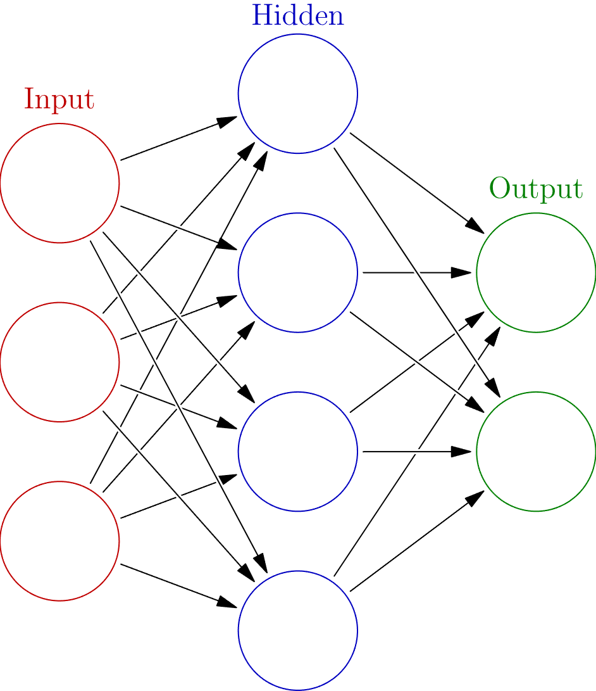

## Feed-Forward Nueral Networks

### Topology

> when i say im using "chatgpt", what exactly does that mean? its the trained model right? do the frameworks have a name? is that what tenserflow is?

> are NN's state machines? if so, is the NN interpolating between unknown inputs? does that mean a NN doesnt work when inputs are outside the training range?

> is 'running' a NN just computer all the activation functions? is this why GPUs are so good for NN because all these linear operations can be easily parrallelised?

> are 'real' NN this simple?

> what makes up the topology of cutting edge networks?

- made up of layers
    - input layer
    - hidden layer(s)
    - output layer

    

- data flows one way (as opposed to recurrent networks which allow bidirectional flow)
- nodes perform non-linear functions on their inputs and output a real number (**Activation Function**)
- signal strength is controlled by a weight at each connection

### Hyperparameters

### Activation Functions

> when computers quantize the signals, do we run the risk of not satisfying the Universal Approximation Theorem (which proves a two-layer NN is a universal function approximator when used with non-linear activation functions)?

> are biases required?

- function performed by a node upon receiving signal(s)

### Training, Backpropogation

> when training finds a local minima, is it like the input produced the correct output, but did it differently than the other correct answers, so it kinda rewarded the right answer without looking at how it got to a solution like if you reward someone for passing a test but they cheated so they keep cheating?

> if i train a NN with garbage input like assigning a number to a letter randomly, how do we make sense of what the NN learned?

> are there multiple cost functions?

> could you perform gradient descent on a binary activation function by counting the changes in 0 and 1?


## Recurrent Neural Network

### Topology

> Minsky and Papert pointed out that recurrent networks can be unrolled in time into a layered feedforward network.[23]: 354 (https://en.wikipedia.org/wiki/Recurrent_neural_network)

- contains loops allowing memory
- good at sequential tasks where previous inputs affect the output


```python
rnn = RNN()
ff = FFN()
hidden_state = [0.0, 0.0, 0.0, ..., 0.0]

for item in input:
    output, hidden_state = rnn(item, hidden_state)

prediction = ff(output)
```
- short term memory (vanishing gradient)
    - long short-term memory (LSTM)
        - uses gates to remember relevant information and forget others
    - gated recurrent unit (GRU)
        - update gate
        - reset gate
        - less tensor operations than LSTM

### Training

- backpropogation
- short term memory


## Word Embeddings

### One-hot encoding
$$
w = \overbrace{\left[ 0, 0, \dots, 1, \dots, 0, 0 \right]}^\text{|V| elements}
$$

- each word $w$ is represented by a one-hot vector
- the draw back besides the huge size is each word is treated independantly with **no relation to each other**

### Dense word embeddings

What if we created dense vectors that captured some semantic attributes of the words, for example:

$$
q_\text{nick} = \left[ \overbrace{3.3}^\text{likes table tennis}, \overbrace{-9.4}^\text{is a professor}, \overbrace{-7.5}^\text{married}, \dots \right]
$$

$$
q_\text{hynek} = \left[ \overbrace{6.5}^\text{likes table tennis}, \overbrace{9.1}^\text{is a professor}, \overbrace{6.4}^\text{married}, \dots \right]
$$

We could measure similarity between words by:

$$
\text{Similarity(physicist, mathematician)} = q_{\text{physicist}} \cdot q_{\text{mathmetician}}
$$

or even better,

$$
\text{Similarity(physicist, mathematician)} = \frac{q_{\text{physicist}} \cdot q_{\text{mathmetician}}}{\|q_{\text{physicist}}\| \|q_{\text{mathmetician}}\|} = \cos{\phi}
$$

Where $\phi$ is the angle between the word vectors. Similar words will have a similarity of 1 and dissimlar words will have a similarity of -1.

Neural networks can learn these *latent semantic attributes* through the assumption that like words will appear close together.

> Further reading: transformers (BERT, GPT), contextual word embeddings (ELMo), attention mechanisms (T5, BART)

### Word2vec

Creates vector representations of words based on surrounding text from a large corpus. Word2vec is a collection of related models used to produce word embeddings. These models are shallow, two-layer networks. Word2vec uses two model architectures:

- Continuous bag of words (CBOW)
- Skip-gram

CBOW is like a 'fill in the blank' test where a fixed sized window surrounding a target word is used to predict the target word.

